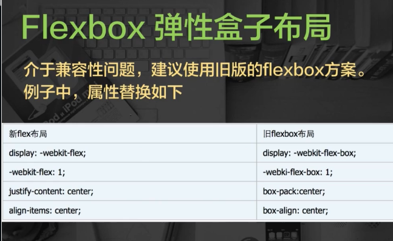

## 移动Web

#### viewport
* width: 设置布局viewport的特定值(deivce-width: 设备宽度)
* initial-scale: 设置页面的初始缩放
* minimum-scale: 最小缩放
* maximum-scale: 最大缩放
* user-scalable: 用户是否缩放

#### 宽度
* document.body.clientWidth = 默认布局viewport
* window.innerWidth = 度量viewport

#### 注意
* 
* 
    1. overflow: scroll;
    2. -webkit-overflow-scrolling: touch;
* 响应式响应: 
    1. 媒体查询media
    2. 百分比
    4. 重新布局，显示与隐藏
    3. 弹性图片(max-width: 100%; height: auto;)
* 1px边框使用sacleY(.5)来处理
* 多行溢出
    1. display: -webkit-box;
    2. overflow: hidden;
    3. text-overflow: ellipsis;
    4. -webkit-box-orient: vertical;
    5. -webkit-line-clamp: 2;
* click事件有点透BUG，300毫秒惹得祸
    1. 动画缓动，过渡300毫秒
    2. 中间层加透明层
    3. 上下层使用tap事件
    4. Fastclick库(最新Zepto去除这个bug)


```html
<!-- 1、HTML标签，以ion开头 -->
<!--标签(指令) -->
<!-- 框架 -->
<ion-header-bar>
<ion-footer-bar>
<!-- 内容 -->
<ion-content>
<ion-refresher>
<ion-pane>
<!-- 滚动 -->
<ion-scroll>
<ion-infinite-scroll>
<!-- 组件 -->
<ion-tabs>
<ion-tab>
<ion-side-menus>
<ion-side-menu-content>
<ion-side-menu>
<ion-nav-view>
<ion-view>
<ion-nav-buttons>
<ion-nav-back-button>
<ion-slide-box>
<!-- 列表 -->
<ion-list>
<ion-item>
<ion-delete-button>
<ion-reorder-button>
<ion-option-button>
<!-- 表单 -->
<ion-checkbox>
<ion-radio>
<ion-toggle>
```

#### Cordova(PhoneGap)
1. 浏览器访问
2. 虚拟机访问
3. 真机器访问

* 使用命令生成指定平台的安装文件(apk、ipa)
